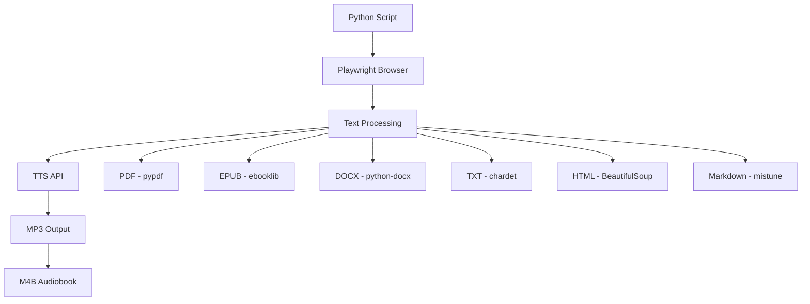

<div align="center">


# Audiobook Creator TTS

### 🎙️ Transform text into high-quality audiobooks with 583 AI voices

*Convert documents, ebooks, and text into professional audio across 76 languages*

[](https://www.python.org/downloads/)
[](voices.json)
[](voices.json)
[](#)

[Quick Start](#-quick-start) • [Features](#-features) • [Documentation](#-documentation) • [Examples](#-examples)

</div>

---

## ✨ Features

<table>
<tr>
<td width="50%" valign="top">

### 🎯 **Smart Document Processing**
- 📄 **Multi-Format Support**: PDF, EPUB, DOCX, TXT, HTML, Markdown
- 🧠 **Intelligent Chunking**: Preserves sentence boundaries
- 📚 **M4B Audiobooks**: Chapter markers & metadata
- 🎵 **Named Output**: `book-1.mp3`, `book-2.mp3`, etc.
- 🔄 **Progress Tracking**: Real-time conversion updates

</td>
<td width="50%" valign="top">

### 🌍 **Extensive Voice Library**
- 🗣️ **583 Premium Voices** across 76 languages
- 👥 Male, female, and multilingual options
- 🎭 Regional accents (UK, US, AU, etc.)
- 🎨 Expressive and standard variants
- 🔊 Professional streaming quality

</td>
</tr>
</table>

---

## 🚀 Quick Start

### Installation

```bash
# 1. Clone repository
git clone https://github.com/oweneldridge/audiobook-creator-tts.git
cd audiobook-creator-tts

# 2. Create virtual environment
python3.11 -m venv venv
source venv/bin/activate  # macOS/Linux
# OR: venv\Scripts\activate  # Windows

# 3. Install dependencies
pip install -r requirements.txt

# 4. Install Playwright browser
playwright install chromium

# 5. (Optional) Install ffmpeg for M4B audiobook creation
# macOS: brew install ffmpeg
# Ubuntu: sudo apt-get install ffmpeg
```

### Usage

<table>
<tr>
<th>Mode</th>
<th>Command</th>
<th>Best For</th>
</tr>
<tr>
<td>📚 <b>Document Mode</b><br/><i>(Recommended)</i></td>
<td><code>python3.11 main_document_mode.py</code></td>
<td>Books, PDFs, documents, ebooks</td>
</tr>
<tr>
<td>💬 <b>Text Mode</b></td>
<td><code>python3.11 main_playwright_persistent.py</code></td>
<td>Short texts, articles, custom content</td>
</tr>
<tr>
<td>🍪 <b>Manual Cookie</b></td>
<td><code>python3.11 main.py</code></td>
<td>Headless servers, automation</td>
</tr>
</table>

> **💡 Tip:** Always activate your virtual environment before running: `source venv/bin/activate`

---

## 📖 Modes Explained

### 📚 Document Mode <sup>**RECOMMENDED**</sup>

Convert entire documents and ebooks into professional audiobooks with chapter markers.

```bash
python3.11 main_document_mode.py

# Or provide file path directly:
python3.11 main_document_mode.py /path/to/document.pdf
```

**Three Flexible Input Methods:**

| Method | Description | Use Case |
|--------|-------------|----------|
| 🖱️ **File Browser** | Native OS file picker | Quick document selection |
| ✍️ **Plaintext Input** | Type or paste directly | Meeting notes, custom text |
| ⌨️ **Manual Path** | Enter file path | Automation, scripting |

**Supported Formats:**
- ✅ **PDF** - Searchable text PDFs
- ✅ **EPUB** - Ebooks (non-DRM)
- ✅ **DOCX** - Microsoft Word documents
- ✅ **TXT** - Plain text (auto-encoding detection)
- ✅ **HTML/HTM** - Web pages and articles
- ✅ **Markdown** - Documentation files

**Output:**
```
audio/
  └── othello_2025-01-14-10-30-45/
      ├── othello-1.mp3
      ├── othello-2.mp3
      ├── othello-3.mp3
      └── othello.m4b  ← Complete audiobook with chapters!
```

**Key Features:**
- ✅ One-time CAPTCHA solving for unlimited conversions
- ✅ Smart text chunking (~1000 chars, sentence-aware)
- ✅ M4B creation with chapter markers and metadata
- ✅ Progress tracking with live updates
- ✅ Named output files based on document name

[📖 **Full Document Mode Guide →**](README_DOCUMENT_MODE.md)

---

### 💬 Text Mode

Perfect for quick text-to-speech conversions and short content.

```bash
python3.11 main_playwright_persistent.py
```

**Features:**
- ✨ Interactive text input (multiline support)
- ♾️ Multiple conversions in one session
- 🌐 Persistent browser session
- 🔄 Type "END" to finish input

**Output:**
```
audio/
  └── 2025-01-14 10-30-45/
      ├── audio_chunk_1.mp3
      ├── audio_chunk_2.mp3
      └── ...
```

---

### 🍪 Manual Cookie Mode

Advanced mode for headless environments and automation.

```bash
python3.11 main.py
```

**Features:**
- 🪶 Lightweight execution (no browser)
- 🖥️ Works in headless environments
- ⚙️ Ideal for automation
- ⚠️ Requires manual cookie extraction

---

## 🎯 Use Cases

<table>
<tr>
<th>📚 Learning & Education</th>
<th>📖 Reading & Entertainment</th>
</tr>
<tr>
<td>
• Study textbooks while commuting<br/>
• Listen to research papers<br/>
• Convert lecture notes to audio<br/>
• Learn languages with native speakers<br/>
</td>
<td>
• Convert ebooks to audiobooks<br/>
• Listen to articles and blogs<br/>
• Enjoy public domain classics<br/>
• Accessibility for visual impairments<br/>
</td>
</tr>
</table>

<table>
<tr>
<th>💼 Professional</th>
<th>🔧 Technical</th>
</tr>
<tr>
<td>
• Convert reports and documents<br/>
• Meeting notes playback<br/>
• Content creation for podcasts<br/>
• Email and document review<br/>
</td>
<td>
• Batch document processing<br/>
• API integration workflows<br/>
• Automated content generation<br/>
• Multi-language localization<br/>
</td>
</tr>
</table>

---

## 📝 Examples

### Example 1: Convert an Ebook with File Browser

```bash
$ python3.11 main_document_mode.py

📝 Input Method:
   1. Select file (opens file browser)
   2. Type or paste text
   3. Enter file path manually

Choice (1, 2, or 3): 1

[Native file picker opens - select your EPUB file]

📚 Reading EPUB...
✅ Extracted 145,230 characters from EPUB

📝 Text preview:
   To be or not to be, that is the question...

📏 Total characters: 145,230
🔢 Estimated chunks: ~146

Proceed with conversion? (y/n): y

[Voice selection...]
✅ Using voice: Emma (US Female)

🎵 Output files will be named: othello-1.mp3, othello-2.mp3, etc.

[Processing...]
✅ Successful: 147/147 chunks
📖 Creating M4B audiobook: othello.m4b
🎉 Complete! Your audiobook is ready.
```

---

### Example 2: Convert Custom Text

```bash
$ python3.11 main_document_mode.py

📝 Input Method:
   1. Select file (opens file browser)
   2. Type or paste text
   3. Enter file path manually

Choice (1, 2, or 3): 2

📝 Custom Output Name
What would you like to name this conversion? Meeting Notes

✅ Output files will be: meeting-notes-1.mp3, meeting-notes-2.mp3, etc.

📝 Enter your text:
(Type END on a new line when finished)

Today's meeting covered quarterly results.
We discussed revenue growth and market expansion.
Action items were assigned to each team.
END

✅ Received 152 characters
🔄 Processing...
```

---

### Example 3: CLI Mode (Automation)

```bash
$ python3.11 main_document_mode.py ~/Documents/report.pdf

📄 File provided via CLI: ~/Documents/report.pdf

[Conversion proceeds with interactive voice selection]
```

---

## 🔧 Configuration

### Chunk Size

Adjust text splitting for different content types (default: 1000 characters):

| Size | Best For |
|------|----------|
| **500-800** | Poetry, short sentences, dramatic pauses |
| **1000** | General books and articles _(recommended)_ |
| **1500-2000** | Technical documents, long passages |

### Voice Selection

**583 voices organized by:**
- 🌍 **Language**: English, Spanish, French, German, Chinese, Arabic, and 70+ more
- 🗺️ **Region**: UK, US, Australia, Canada, India, etc.
- 👤 **Gender**: Male and female options
- 🎭 **Style**: Standard and expressive variants

---

## 📊 Performance

| Metric | Value |
|--------|-------|
| **Processing Speed** | ~1-2 seconds per chunk |
| **Throughput** | ~50-100 chunks per hour |
| **Large Book (500 pages)** | 30-60 minutes |
| **Audio Format** | MP3 (streaming quality) |
| **File Size** | ~30-50 KB per chunk |

---

## 🔍 Troubleshooting

<details>
<summary><b>🚫 "File browser not available (tkinter not installed)"</b></summary>

**Quick Solutions:**
- ✅ **Option 2**: Type or paste text directly (no tkinter needed)
- ✅ **Option 3**: Enter file path manually (no tkinter needed)
- ✅ **CLI Mode**: `python3.11 main_document_mode.py /path/to/file.pdf`

**Why this happens:**
- tkinter isn't included in all Python installations (pyenv, conda, custom builds)
- File browser is optional - other methods work perfectly

**To enable file browser (optional):**

**macOS (with pyenv):**
```bash
brew install tcl-tk

env \
  PATH="$(brew --prefix tcl-tk)/bin:$PATH" \
  LDFLAGS="-L$(brew --prefix tcl-tk)/lib" \
  CPPFLAGS="-I$(brew --prefix tcl-tk)/include" \
  PKG_CONFIG_PATH="$(brew --prefix tcl-tk)/lib/pkgconfig" \
  CFLAGS="-I$(brew --prefix tcl-tk)/include" \
  PYTHON_CONFIGURE_OPTS="--with-tcltk-includes='-I$(brew --prefix tcl-tk)/include' --with-tcltk-libs='-L$(brew --prefix tcl-tk)/lib -ltcl8.6 -ltk8.6'" \
  pyenv install --force 3.11.11
```

**Ubuntu/Debian:**
```bash
sudo apt-get install python3-tk
```
</details>

<details>
<summary><b>🔴 "403 Forbidden" errors</b></summary>

- CAPTCHA needs solving
- Script will prompt automatically
- Keep browser window visible
</details>

<details>
<summary><b>📄 "No text extracted from PDF"</b></summary>

- PDF might be scanned images (needs OCR)
- Verify PDF has selectable text
- Try a different PDF
</details>

<details>
<summary><b>🌐 Browser won't open</b></summary>

- Install Chromium: `playwright install chromium`
- Ensure you have a desktop session
- Use manual cookie mode for headless environments
</details>

---

## 🛠️ Technical Architecture



### Core Dependencies

**Runtime:**
- **requests** - HTTP communication
- **playwright** - Browser automation

**Document Processing:**
- **pypdf** - PDF extraction
- **ebooklib** - EPUB extraction
- **python-docx** - DOCX extraction
- **chardet** - Encoding detection
- **beautifulsoup4** - HTML parsing
- **mistune** - Markdown parsing

**Audio Processing:**
- **ffmpeg** - M4B audiobook creation (optional)

---

## 💡 Pro Tips

| Tip | Description |
|-----|-------------|
| 🧪 **Start Small** | Test with small documents first |
| 🎭 **Match Voices** | British English for Shakespeare, etc. |
| 📏 **Adjust Chunks** | Smaller for poetry, larger for prose |
| 👀 **Keep Visible** | Don't minimize browser during conversion |
| 🌐 **Stable Internet** | Ensure reliable connection for long books |
| 📦 **Use M4B** | Single file with chapters > multiple MP3s |

---

## 📚 Documentation

- [📖 Document Mode Full Guide](README_DOCUMENT_MODE.md) - Comprehensive PDF/EPUB conversion guide
- [🎯 Project Overview](CLAUDE.md) - Technical architecture and development notes

---

## 🚀 What's Next?

### Current Features
- ✅ 583 voices across 76 languages
- ✅ Multi-format document support
- ✅ M4B audiobook creation
- ✅ Persistent browser sessions
- ✅ Smart text chunking
- ✅ Progress tracking

### Roadmap
- [ ] Batch processing multiple files
- [ ] Resume interrupted conversions
- [ ] Audio merging and splitting tools
- [ ] ODT and RTF support
- [ ] Custom voice speed and pitch control
- [ ] GUI application

---

## 🙏 Acknowledgments

This project is built upon [Speechma-API](https://github.com/fairy-root/Speechma-API) by [FairyRoot](https://github.com/fairy-root).

**Enhancements in this fork:**
- ✨ Complete 583-voice library from speechma.com
- 🎭 Playwright-based persistent browser automation
- 📚 Multi-format document processing (PDF, EPUB, DOCX, TXT, HTML, Markdown)
- 🎵 M4B audiobook creation with chapter markers and metadata
- 📋 Comprehensive documentation and examples
- 🔧 Modern dependency management with requirements.txt

---

## 📄 License

This project is for personal and educational use. Please respect speechma.com's terms of service.

---

## 🤝 Contributing

Found a bug or have a feature request? Please [open an issue](../../issues)!

---

<div align="center">

### 🎧 Ready to Create Your First Audiobook?

**For documents:**
```bash
python3.11 main_document_mode.py
```

**For text:**
```bash
python3.11 main_playwright_persistent.py
```

---

**Made with ❤️ for audiobook enthusiasts**

*Star ⭐ this repo if you find it helpful!*

</div>
